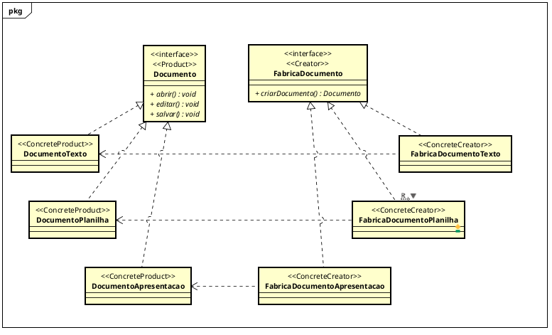

# Implementação e revisão crítica

## Diagrama UML



## Prompt usado para início da implementação

```text
Quero que você implemente, em Java, um sistema seguindo o meu diagrama UML, criado para o padrão Factory Method.

O código deve refletir diretamente o diagrama UML que já foi modelado.

A estrutura obrigatória do UML é composta pela interface Documento, com os métodos void abrir(), void editar() e void salvar(); pelas classes DocumentoTexto, DocumentoPlanilha e DocumentoApresentacao, que implementam Documento; pela interface FabricaDocumento, com o método Documento criarDocumento(); e pelas classes FabricaDocumentoTexto, FabricaDocumentoPlanilha e FabricaDocumentoApresentacao, que implementam FabricaDocumento.

Cada fábrica concreta deve criar somente o seu documento correspondente.

Os arquivos devem ser separados por classe e interface. Também deve ser criada uma classe Main simples para demonstrar a criação de um documento usando sua fábrica e a execução dos métodos abrir(), editar() e salvar().
```

## 1. Ponto identificado para melhoria

Partindo para a implementação a partir do UML criado e solicitando que a estrutura fosse seguida, nota-se, inicialmente, um dos principais problemas que podem ocorrer ao trabalhar com agentes de IA. Isso não acontece necessariamente por causa do agente, mas pela falta de informações fornecidas a ele, seja por fazer um pedido genérico ou por não definir uma arquitetura de código. Nesse caso, o código foi criado sem separação, o que pode dificultar a orientação do desenvolvimento.

O diagrama indicava as classes que deveriam existir e como elas se relacionavam, mas não apresentava detalhes sobre regras de negócio e decisões de implementação, como: de que forma o armazenamento seria representado, como o conteúdo seria utilizado e manipulado e como as operações `abrir()`, `editar()` e `salvar()` seriam de fato realizadas.

Essa falta de direcionamento não é um problema direto do UML, pois ele cumpre o que foi solicitado. Entretanto, deixava espaço para diferentes interpretações durante a implementação.

## 2. Implementação e revisão crítica

Como descrito anteriormente, a partir do ponto de melhoria identificado, foi seguida uma nova metodologia muito utilizada atualmente no trabalho com agentes: o SDD (Spec-Driven Development). Foi criado um `spec.md` com mais detalhes e regras para orientar os ajustes na implementação.

Esse método é interessante porque permite manter um histórico das regras de negócio e documentar o processo de desenvolvimento, deixando as orientações mais claras e mantendo a estrutura do Factory Method definida no UML.

Foram especificadas regras como:

- devem existir documentos dos tipos Texto, Planilha e Apresentação;
- cada tipo deve ser criado por sua própria fábrica;
- todos os documentos devem permitir abrir, editar e salvar;
- a criação deve seguir o padrão Factory Method;
- cada fábrica concreta deve criar somente o documento correspondente.

## Documentos utilizados para a melhoria

Especificação utilizada: [OpenSpec — spec.md](openspec/spec.md).

Implementação realizada com base no SDD: [código da implementação](src/main/java/factorymethod).
